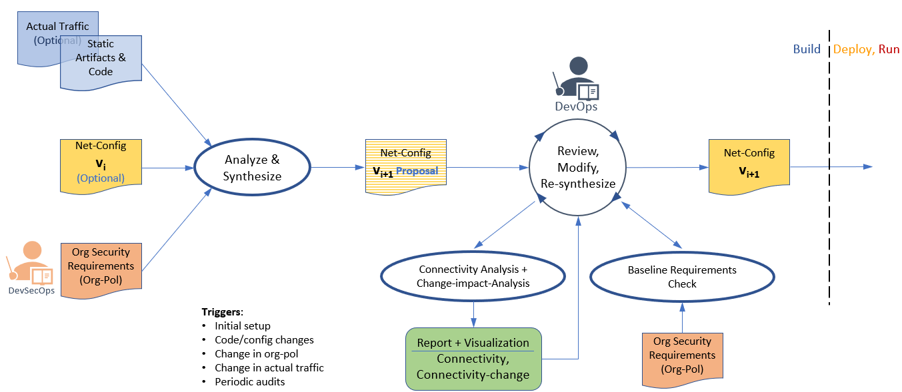

###  Shift-left Automatic Generation of Network Policies
This project looks at the problem of simplifying the experience of creating K8s NetworkPolicies for zero-trust environments. Recognizing how hard it is for users to create and manage K8s NetworkPolicies to enable just the right amount of connectivity (not more or less), we propose a solution to automating the generation of NetworkPolicies without having to run the applications' code. Our solution can be integrating into the application CI/CD pipeline. Its overall flow is presented below.

Our [GitHub Org](https://github.com/shift-left-netconfig) contains the source code for all the components in the above flow (shown as elipsses). In particular it contains the following repos.
- [cluster-topology-analyzer](https://github.com/shift-left-netconfig/cluster-topology-analyzer) - Scans a GitHub repo and extracts required network links.
- [netpol-synthesizer](https://github.com/shift-left-netconfig/netpol-synthesizer) - Synthesizes a set of K8s NetworkPolicies from the list of requried network links and a set of baseline requirements.
- [network-config-analyzer](https://github.com/shift-left-netconfig/network-config-analyzer) - Allows showing synthesized connectivity as a set of firewall rules. Can also produce connectivity diff between two network configurations.
- [baseline-rules-verifier](https://github.com/shift-left-netconfig/baseline-rules-verifier) - Checks whether synthesized connectivity satisifies a set of baseline requirements.

The overall flow is demoed on [an example application](https://github.com/shift-left-netconfig/microservices-demo). See the [step-by-step screenplay](https://github.com/shift-left-netconfig/microservices-demo/blob/master/POC-screenplay.md) of the demo.
